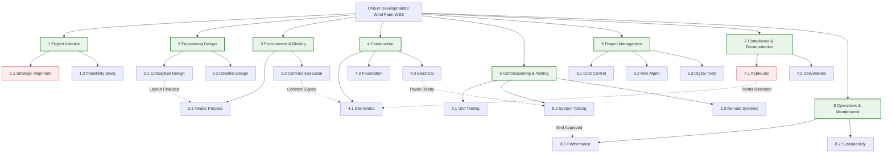

# Purpose Statement
The UNSW Developmental Wind Farm project aims to support UNSW's 2025 strategic goals by developing a sustainable energy solution that integrates teaching, research, and operations. The project will provide a platform for renewable energy research while reducing the university's carbon footprint.

---

# Scope Statement
<!-- **English**   -->
The project scope covers the full lifecycle of developing UNSW's 30MW scalable wind farm, including strategic alignment, engineering design with future expansion capacity, regulatory-compliant construction, and operational integration with research systems. Core components:  
- Scalable infrastructure for 8→10 turbine units  
- Remote monitoring system integrated with campus  
- Full compliance with NSW planning and heritage regulations  
- Maintenance systems supporting 10-year operations  

<!-- **中文**  
项目范围涵盖UNSW可扩展风电场的全生命周期开发，包含战略对齐、预留扩展的工程设计、合规施工及与研究系统的运营整合。核心要素：  
- 8→10台风机的可扩展基础设施  
- 与校园集成的远程监控系统  
- 符合新州规划及文化遗产法规  
- 支持10年运维的维护体系 -->

---

# Key Deliverables
<!-- **English**   -->
1. Strategic Alignment Report (UNSW 2025 Gap Analysis)  
2. Scalable Turbine Layout Blueprint (10-unit capacity)  
3. NSW Planning Portal Submission Package  
4. As-built Drawings with Heritage Protection Notes  
5. SCADA Integration Test Certificates  
6. Annual Performance Report Template  
7. Blade Recycling Protocol  
8. Digital Twin Model (BIM Level 3)  

<!-- **中文**  
1. 战略对齐报告（UNSW 2025差距分析）  
2. 可扩展风机布局蓝图（10台容量）  
3. 新州规划门户申报包  
4. 含遗产保护注释的竣工图纸  
5. SCADA系统集成测试证书  
6. 年度性能报告模板  
7. 叶片回收协议  
8. 数字孪生模型（BIM三级）   -->

---

# Constraints
<!-- **English**   -->
- **Budget**: Fixed at AUD $48M (designated for 8 turbines)  
- **Duration**: Shortest feasible timeline (commissioning ≤24 months)  
- **Regulatory**: Mandatory Aboriginal heritage surveys prior to earthworks  
- **Technical**: Minimum 30MW electrical system capacity for future expansion  
- **Social**: Ongoing wildlife impact monitoring during operations  

<!-- **中文**  
- **预算**: 固定4800万澳元（8台风机专项）  
- **工期**: 最短可行时间（调试≤24个月）  
- **法规**: 土方工程前强制土著遗产调查  
- **技术**: 未来扩展需30MW电气系统容量  
- **社会**: 运营期间持续野生动物影响监测 -->
---
# Code for WBS Graph

---